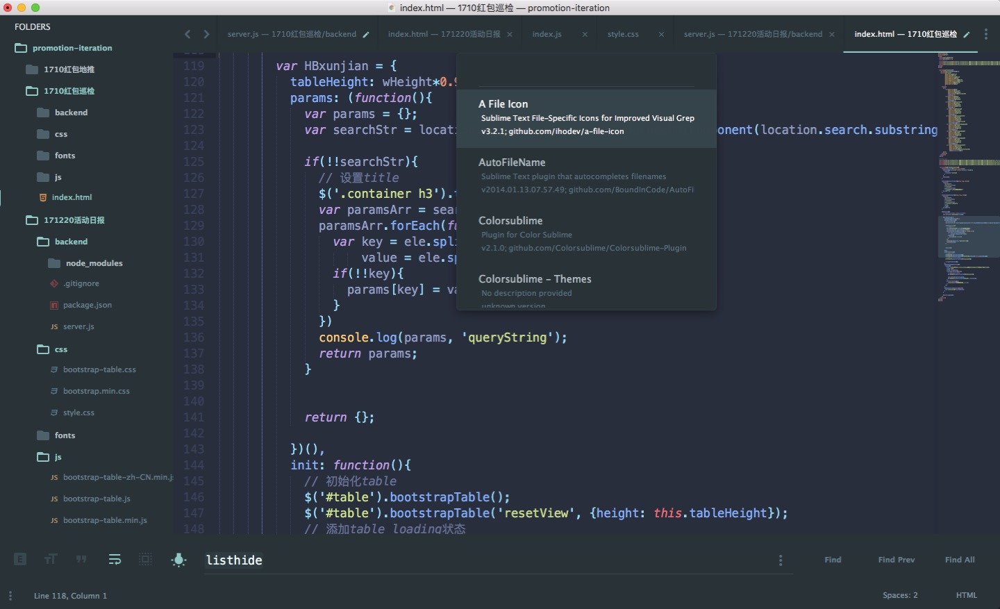

### sublime 配置

sublime配置可以通过控制台（`ctrl||cmd + shift + p`打开）来配置。

有些插件压缩包（包括sass和less等）放在当前目录的 `plugins` 文件夹下。

#### 常用插件合集

|  插件名称          |   说明   |
|:----------------:|:--------:|
|  *AutoFileName*  |文件里打了引号自动搜寻当前路径文件|
|  *Emmet*         |html,css快捷输入              |
|  *javascript completions*|js自动补全            |
|  *Side Bar*      |侧边栏扩展插件，增加了很多实用功能|
|  *html/css/js pretty*|格式化代码（需要安装node）  |
|  *File Header*|新建文件自动加相应的头部信息        |
|  *ColorSublime*|更换不同配色方案的插件|
|----------------|------------------------------|
|**主题推荐**||
|*Material Theme*|[官网](https://packagecontrol.io/packages/Material%20Theme)|
|**主题配套插件**||
|*A File Icon*|丰富侧边栏文件小图标|

#### 主题用户自定义配置

```json
{
	"always_show_minimap_viewport": true,
	"bold_folder_labels": true,
	"color_scheme": "Packages/Material Theme/schemes/Material-Theme-Palenight.tmTheme",
	"font_size": 17,
	"ignored_packages":
	[
		"Vintage"
	],
	"indent_guide_options":
	[
		"draw_normal",
		"draw_active"
	],
	"line_padding_bottom": 1,
	"line_padding_top": 1,
	"overlay_scroll_bars": "enabled",
	"tab_size": 2,
	"theme": "Material-Theme.sublime-theme",
	"word_wrap": false,
	"material_theme_tabs_separator": true
}
```

#### 预览图



